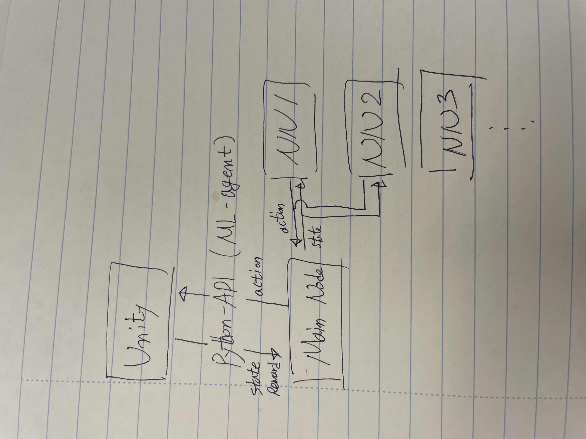

# autoDrone
계층 구조 네트워크를 가지는 강화학습 기반 자율주행 드론

# 계층 구조의 네트워크를 가지는 자율주행 드론

- 여러개의 네트워크를 가지는 드론이 각 상황에 맞는 네트워크를 사용하여 주행
- 네트워크는 호버링, GPS기반 주행, UWB기반 주행, 장애물 회피 등이 될 수 있음
- 

## 실험의 주요 주목점

- 각 task에 대하여 필요한 네트워크가 무엇인지 분류하는 것이 중요함  
일단은 task를 크게 분류하여 네트워크 수를 줄여 분류를 간단히 할 예정
- 각 네트워크를 각 task에 대하여 학습한 후 main node와 잘 녹아들지
- 

## 구현에 대하여

- 각 네트워크와 메인 제어는 노드화 하여 ROS2에서 구현
- 

## 실험에 대하여

- Unity를 활용하여 environment와 agnet, action-reward 관계를 설계
- Unity에서 제공하는 python-API인 ML-agent를 통해 observation을 외부로 가져와 학습 후 action을 전송하여 Unity 상에서 시뮬레이션 진행
- 사용하는 강화학습 알고리즘은 PPO를 사용할 것으로 생각 중

## 환경에 대하여

- agent는 random으로 x, y, z 축으로 움직임  
드론의 주행은 pixhwak와 같은 외부 보드가 당담한다고 가정 (외부 제어 보드에는 3축 병진 명령만 전달)
- target은 train시 랜덤한 위치에, demo시 키보드로 설정할 수 있도록
- 호버링 네트워크의 경우 target에 자리를 유지할수록 reward ++  
주행 네트워크의 경우 target에 접근할 경우 reward 1

